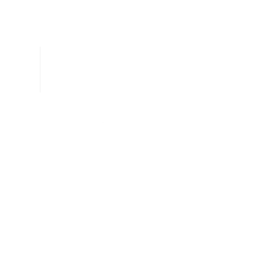

<p align="center">
  <a href="https://nysa.phrolova.moe/">
    
  </a>
</p>

<h1 align="center">Nysa</h1>

<p align="center">
  A quiet presence across your <em>entire</em> digital life.
</p>

<p align="center">
  <a href="https://nysa.phrolova.moe/">
    
  </a>
  <a href="./LICENSE">
    
  </a>
  
</p>

---

> [!WARNING]
> Nysa's codebase is currently being ported over here from the old codebase and being refactored/rewritten, thus a lot of the original (and advertised) functionality is missing for now.

Nysa is an open-source, general-purpose AI agent framework written in
Rust. It talks to you across platforms, remembers things the way a
person would, joins your voice calls, plays games with you, and can be
extended to do just about anything else.

## What it does

- **Multi-platform chat** — Discord today, Fluxer soon, more through
  the extensions API.
- **Human-like memory** — a memory engine that mimics how people
  actually think, backed by vectorized context for active memory.
- **Voice** — Nysa can join voice channels and talk to you.
- **Gaming** — Minecraft is officially supported. More to come.
- **Extensible by design** — the extensions API lets you build
  whatever Nysa doesn't do yet.

## Architecture

Nysa is a library first, binary second. The included binary is
minimal: it loads your config and hands everything off to the
framework. This is intentional. If you need a different setup, you
write a thin binary on top of the library and you're done.

### Built with

| Crate    | Role                  |
| -------- | --------------------- |
| Serenity | Discord gateway       |
| Poise    | Command framework     |
| Songbird | Voice                 |
| SeaORM   | Database (PostgreSQL) |
| pgvector | Vector similarity     |

## Getting started

You'll need Rust nightly and a PostgreSQL instance with the pgvector
extension.

```bash
cargo build -p nysa-sh --release
```

That's it. See the
[configuration reference](https://nysa.phrolova.moe/) for everything
else.

## Nysa Cloud

Don't want to self-host? **Nysa Cloud** is coming soon. Same Nysa,
zero setup.

The open-source project isn't going anywhere. Nysa is and will always
be free to use and self-host. Cloud is just the easy route for people
who'd rather not manage infrastructure.

## Contributing

Contributions are welcome. You submit code under
AGPL-v3, same as the rest of the project.

## License

Nysa is licensed under the
[GNU Affero General Public License v3.0](./LICENSE).
